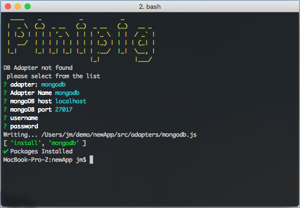

# Getting Started with Pinipig CLI

## Installing the CLI

Pinipig CLI makes it quick to spin up a new Pinipig App

`npm install -g pinipig-cli`

## Create a new app

To create a new pinipig app

- create a new directory `mkdir newApp`
- `cd newApp`
- `pinipig init`

Options

```
Usage: pinipig [options] [command]

Options:
  -V, --version          output the version number
  -h, --help             output usage information

Commands:
  init [options] [name]  run setup commands for all envs
  adapter|db [options]   Add DB Adapter
  model|m [options]      create a Model

```


The `init` command will generate the following istructure inside the `newApp` directory

```
├── node_modules
│   ├── 8colors
│   └── ...
├── package-lock.json
├── package.json
└── src
    ├── adapters
    ├── config
    │   └── default.json
    ├── helper.js
    ├── hooks
    ├── index.js
    ├── middlewares
    │   └── root.js
    ├── models
    ├── public
    │   └── index.html
    ├── routes
    │   ├── index.js
    │   └── root.js
    ├── schemas
    └── services
```

## Define an Adapter / Database

Usage `pinipig db`

Follow on-screen



## Define a new Model and create a CRUD route (REST)

Sample usage

`pinipig model -m post -r -a mongodb title:string,content:string,date:date,author_id:number`

```
Usage: model|m [options]

create a Model

Options:
  -m,  --model <model>
  -a,  --adapter <adapter name>
  -r --route
  -h, --help               output usage information
```

Output


